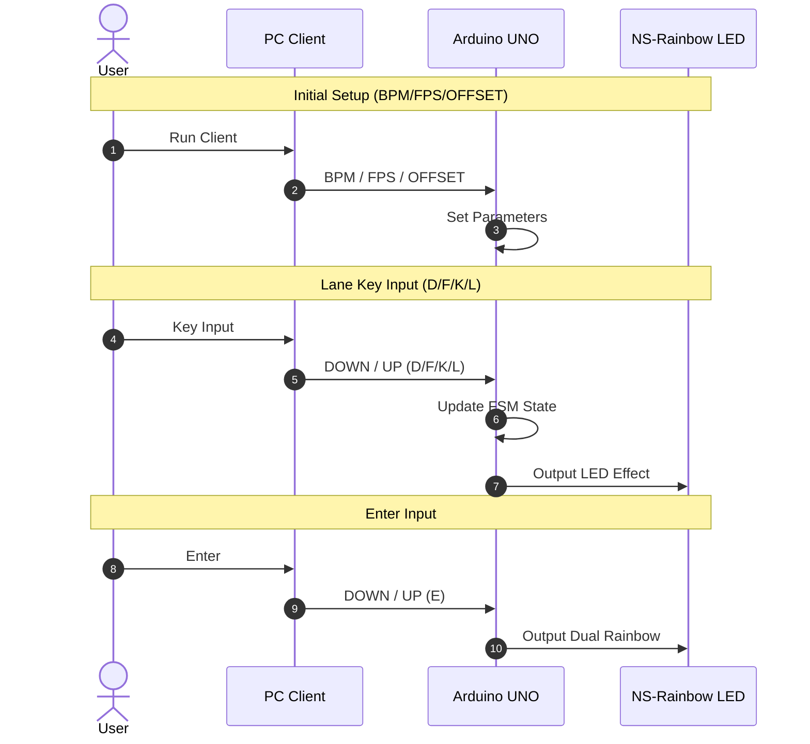
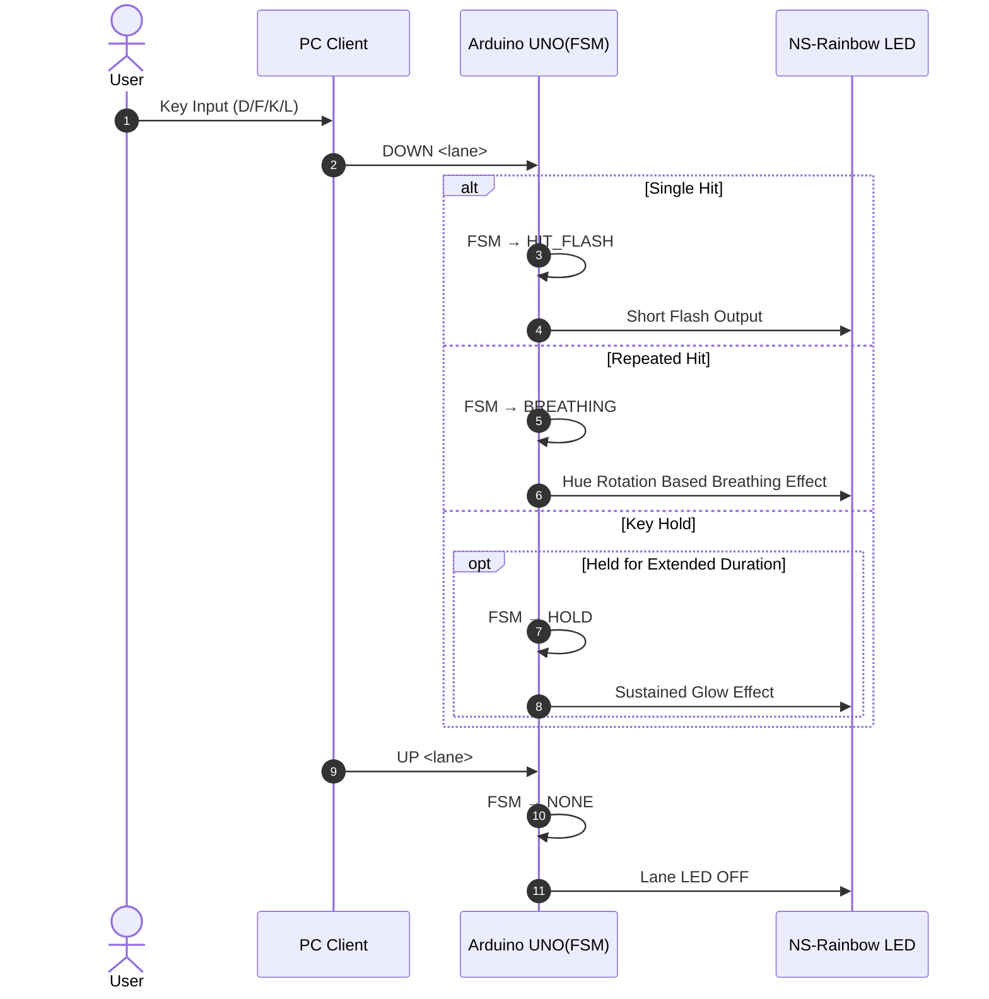

# PLATiNA‑LED

https://github.com/user-attachments/assets/d5320a50-baea-4660-8e7b-4228908b1e18

A project that visualizes 4-key lane inputs from the rhythm game [PLATiNA :: LAB](https://platinalab.net/) in real-time using the [`NS‑LED‑02`](./NS-LED.pdf).

This codebase consists of two parts:

1. `NS‑LED‑02` Controller ([`main.ino`](main/main.ino))
2. 4-Key Hooking & Serial Transmission Client ([`main.py`](main/main.py))

## Overview

### ⚡ Hardware Wiring Diagram

```
   Arduino UNO                      NS-Rainbow Stick
┌─────────────────┐               ┌──────────────────┐
│                 │               │  [●●●●●●●●]  (8 LEDs)
│           5V ───────────────▶   │   VCC
│          GND ───────────────▶   │   GND
│           D9 ───────────────▶   │   DATA (Signal In)
│                 │               │
└─────────────────┘               └──────────────────┘
```

- DATA Pin: D9 (PWM capable pin)
- VCC: 5V
- GND: Common ground

### 🎮 Input

The Python client hooks key inputs from the PC game (PLATiNA LAB) and transmits them to the Arduino immediately.

Example usage:

```bash
python3 main.py \
  --port /dev/cu.usbserial-2120 \
  --baud 115200 \
  --bpm 180 \
  --offset 0
```

#### Supported Keys

- <kbd>A</kbd> → D Lane
- <kbd>S</kbd> → F Lane
- <kbd>;</kbd> → K Lane
- <kbd>'</kbd> → L Lane
- <kbd>Enter</kbd> → Dual Rainbow Trigger
- <kbd>ESC</kbd> → Exit Client

## Serial Protocol

PC → Arduino communication uses **line-based commands**.

### Configuration Commands

```
BPM <number>
OFFSET <ms>
```

Example:

```
BPM 180
OFFSET 0
```

## LED Stick Control

### LED Hardware

- Model: **NS‑LED‑02 (Rainbow Stick)**
- LED Count: **8**
- Pin: **D9**
- Library: `NS_Rainbow`

### Lane Structure (4-Key)

Each lane consists of 2 LEDs.

| Lane | Input | LED Index |
| ---- | ----- | --------- |
| 0    | D     | 0, 1      |
| 1    | F     | 2, 3      |
| 2    | K     | 4, 5      |
| 3    | L     | 6, 7      |

## LED Effect System

### Single Hit Effect — Hit Flash

- Lights up brightly with the lane's Hue → Rapid decay
- Duration is **automatically calculated based on BPM**
  - `flashDurationMs = beatMs / 3`

### Repeated Input on Same Key — Breathing Rainbow

- Brightness pulse speed increases based on repeat count of the same key
- Hue gradually changes over time with repeated inputs

### Enter — Dual Rainbow

- Dual rainbow converging from both ends toward the center across 8 LEDs
- Duration is BPM-based
  - `dualRainbowDurationMs = beatMs * 2`

## BPM-Based Animation

Arduino receives BPM input and automatically recalculates the following values:

| Item                    | Formula       |
| ----------------------- | ------------- |
| `beatMs`                | `60000 / BPM` |
| `flashDurationMs`       | `beatMs / 3`  |
| `breathingPeriodBaseMs` | `beatMs * 2`  |
| `dualRainbowDurationMs` | `beatMs * 2`  |

This enables LED effects synchronized to the music BPM.

## LED Offset (ms)

Due to the nature of rhythm games, fine-tuning of LED response timing is necessary.\
There is an offset feature to adjust the delay between input and LED response.

```
OFFSET 30   → Light up 30ms later
OFFSET 0    → Immediate response
```

## FPS Synchronization

To match the loop execution frequency with the game's frame rate:

```
const int targetFPS = 60;
unsigned long frameDelayMs = 1000 / targetFPS;
```

This maintains a consistent LED update cycle.

## Sequence Diagram

### Initial Setup, Lane Key Input, Enter Input



### Lane Key Input State Management



- `HIT_FLASH`: Single hit
- `BREATHING`: Repeated hits and key hold
- `NONE`: Key released

LED control flow designed based on Finite-State Machine (FSM).

## Summary

- Key input → Serial transmission → Lane effects properly reflected
- BPM-based LED visualization working
- Repeated input detection (Breathing)
- Dual Rainbow working properly

### Future Expansion Ideas

- [x] Enable BPM updates during execution
- [ ] Extend Dual Rainbow effect key mapping for other rhythm games (e.g., Shift, Space, etc.)
