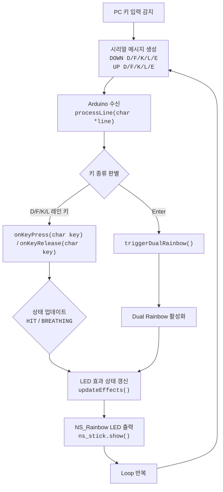

# PLATiNA‑LED

https://github.com/user-attachments/assets/e6d7e4c1-7250-472a-98e9-356393bfd2fc

리듬게임 [PLATiNA :: LAB](https://platinalab.net/)의 4키 레인 입력을
[`NS‑LED‑02`](./NS-LED.pdf)으로 실시간 시각화하는 프로젝트입니다.

본 코드베이스는 다음 두 부분으로 구성됩니다.

1. `NS‑LED‑02` 제어 ([`main.ino`](main/main.ino))
2. 4키 후킹 & 시리얼 송신 클라이언트 ([`main.py`](main/main.py))

## 개요

### 🎮 입력(플라티나 랩 키보드 입력)

PC 게임(플라티나 랩)에서 발생하는 키 입력을 Python 클라이언트가 후킹하여
Arduino로 즉시 전송합니다.

실행 예:

```bash
python3 main.py \
  --port /dev/cu.usbserial-2120 \
  --baud 115200 \
  --bpm 180 \
  --offset 0
```

#### 지원 키

- **A → D 레인**
- **S → F 레인**
- **; → K 레인**
- **' → L 레인**
- **Enter → Dual Rainbow 트리거**
- **ESC → 클라이언트 종료**

## 시리얼 프로토콜

PC → Arduino 통신은 **라인 단위 명령**으로 이루어집니다.

### 설정 명령

```
BPM <number>
OFFSET <ms>
```

예:

```
BPM 180
OFFSET 0
```

## LED 스틱 제어

### LED 하드웨어

- 기종: **NS‑LED‑02 (Rainbow Stick)**
- LED 개수: **8개**
- 핀: **D9**
- 라이브러리: `NS_Rainbow`

### 레인 구조 (4키)

각 레인은 2개의 LED로 구성됩니다.

| 레인 | 입력 | LED 인덱스 |
| ---- | ---- | ---------- |
| 0    | D    | 0, 1       |
| 1    | F    | 2, 3       |
| 2    | K    | 4, 5       |
| 3    | L    | 6, 7       |

## LED 효과 시스템

### 단타 효과 — Hit Flash

- 해당 레인의 Hue로 밝게 점등 → 빠르게 감쇠
- 길이는 **BPM 기반으로 자동 계산**
  - `flashDurationMs = beatMs / 3`

### 같은 키의 반복 입력 — Breathing Rainbow

- 같은 키의 반복 횟수에 따라 밝기 펄스 속도 증가
- 반복 입력의 시간 경과에 따라 Hue가 서서히 변함

### Enter — Dual Rainbow

- 8개의 LED 양쪽에서 중심으로 수렴하는 이중 레인보우
- 길이는 BPM 기반
  - `dualRainbowDurationMs = beatMs * 2`

## BPM 기반 애니메이팅

Arduino는 BPM 입력을 받아 아래 값을 자동 재계산합니다:

| 항목                    | 계산식        |
| ----------------------- | ------------- |
| `beatMs`                | `60000 / BPM` |
| `flashDurationMs`       | `beatMs / 3`  |
| `breathingPeriodBaseMs` | `beatMs * 2`  |
| `dualRainbowDurationMs` | `beatMs * 2`  |

이를 통해 음악 BPM에 맞춘 LED 연출이 가능합니다.

## LED Offset (ms)

리듬게임 특성상 LED 반응 타이밍을 미세 조정할 필요가 있으므로\
IP → LED 사이 지연을 조절하기 위한 오프셋 기능이 있습니다.

```
OFFSET 30   → 30ms 늦게 점등
OFFSET 0    → 즉시 반응
```

## FPS 동기화

루프의 실행 빈도를 게임 설정의 초당 프레임과 맞추기 위해:

```
const int targetFPS = 60;
unsigned long frameDelayMs = 1000 / targetFPS;
```

LED 업데이트 주기를 일정하게 유지합니다.

## 전체 흐름도



유한 상태(Finite-state) 바탕의 안정된 LED 제어 흐름을 갖추었습니다.

## 요약

- 키 입력 → 시리얼 전송 → 레인 효과 정상 반영
- BPM 기반 LED 시각화 동작
- 반복 입력 감지(Breathing)
- Dual Rainbow 정상 작동

### 추후 확장 아이디어

- [ ] 실행 중에 BPM 업데이트 가능하게 하기
- [ ] 다른 리듬게임을 위한 Dual Rainbow 효과 키 매핑 확장하기(예: Shift, Space
      등)
