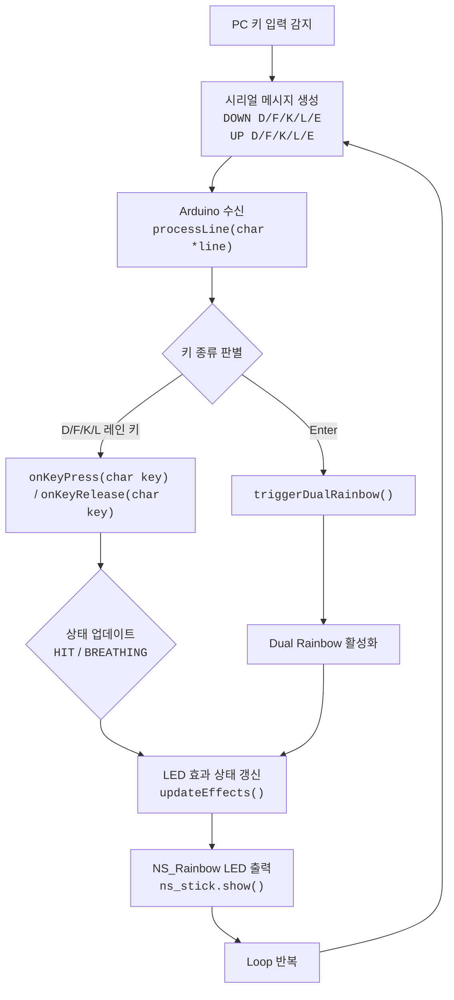

# 리듬게임 LED 시각화 "PLATiNA-LED" 프로젝트 최종 보고서

제주대학교 컴퓨터공학전공 — 임베디드 소프트웨어\
김무훈

## 1. 서론

초기 과제 주제였던 _“빛과 움직임 → 볼 수 있는 소리”_ 는 외부 조명에 의한 간섭,
센서 조합 복잡성, 각도·거리 변화에 따른 측정 불안정성 등의 이유로 안정적인 실험
환경을 보장하기 어려웠다. 이에 따라 **측정 안정성과 실시간성을 확보할 수 있는
디지털 입력 기반 아키텍처**로 주제를 변경하였다.

본 프로젝트는 리듬게임의 입력 패턴(<kbd>D</kbd>, <kbd>F</kbd>, <kbd>K</kbd>,
<kbd>L</kbd>,
<kbd>Enter</kbd>)과 박자(BPM)를 기반으로, **Arduino UNO와 NS-Rainbow LED 모듈을
이용하여 직관적인 “리듬 시각화 기기”를 구현**하는 것을 목표로 했다.

본 보고서는 전체 개발 과정 및 결과를 아래 순서로 소개한다.

1. Arduino–LED 하드웨어 설계
2. Mermaid 기반 프로그램 흐름도
3. 시각화 알고리즘에 사용된 수식 해설
4. PC–임베디드 연동 실험 결과

## 2. 시스템 구성

### 2.1 전체 구성 요약

본 시스템은 다음 세 요소로 구성된다.

- **PC 클라이언트(Python, pynput)**\
  키보드 입력(<kbd>D</kbd>, <kbd>F</kbd>, <kbd>K</kbd>, <kbd>L</kbd>,
  <kbd>Enter</kbd>)을 후킹하여 Arduino로 시리얼 전송
- **Arduino UNO 기반 LED 컨트롤러**\
  레인별 상태 머신(HIT/BREATHING)로 LED 애니메이션 결정
- **NS-Rainbow LED 스틱(8-cell)**\
  4개의 레인(각 2개 LED)을 표현하는 출력 장치

### 레인 구조 (4키)

각 레인은 2개의 LED로 구성됩니다.

| 레인 | 입력 | LED 인덱스 |
| ---- | ---- | ---------- |
| 0    | D    | 0, 1       |
| 1    | F    | 2, 3       |
| 2    | K    | 4, 5       |
| 3    | L    | 6, 7       |

## 3. 하드웨어 구성

### 3.1 Arduino UNO ↔ NS-Rainbow LED 배선도

```
   Arduino UNO                      NS-Rainbow Stick
┌─────────────────┐               ┌──────────────────┐
│                 │               │  [●●●●●●●●]  (8 LEDs)
│           5V ───────────────▶   │   VCC
│          GND ───────────────▶   │   GND
│           D9 ───────────────▶   │   DATA (Signal In)
│                 │               │
└─────────────────┘               └──────────────────┘
```

- DATA 핀: D9 (PWM 가능 핀)
- VCC: 5V
- GND: 공통 접지

## 4. 프로그램 설계

### 4.1 전체 흐름도



유한 상태(Finite-state) 바탕의 안정된 LED 제어 흐름을 갖추었습니다.

## 5. 알고리즘 및 수식 설명

### 5.1 BPM 기반 속도 계산

```
beatMs = 60000 / BPM
```

- BPM(Beat per Minute)을 ms 단위로 환산
- 모든 LED 이펙트의 타이밍 기준
- 예: BPM=180 → beatMs ≈ 333.33ms

### 5.2 Hue(색상) 변화 공식

Breathing 효과에서 Hue는 회전하며 Rainbow 효과를 만든다.

```
huePhase = (huePhase + speed) mod 360
speed = 0.8 + (repeatCount - 1) * 0.6
```

- repeatCount 증가 → Hue 회전이 빨라짐
- 연타일수록 화려한 색 변화를 제공

### 5.3 Breathing 밝기 변화

```
brightness = 0.3 + 0.7 * ((sin(phase) + 1) / 2)

phase = 2π * (elapsed / periodMs)
periodMs = breathingPeriodBaseMs / repeatCount
```

- sin파로 자연스러운 “숨쉬기” 효과
- repeatCount 증가 → 주기(period)가 짧아져 빠른 호흡

### 5.4 Hit Flash 감쇠 공식

```
brightness = 1 - (elapsed / flashDurationMs)
```

- 첫 순간은 밝게, 이후 짧은 시간 동안 빠르게 감쇠
- 단타(정타) 효과 표현에 적합

### 5.5 레인 상태 머신

| 상태      | 설명                                       |
| --------- | ------------------------------------------ |
| HIT_FLASH | 단타 순간 플래시                           |
| BREATHING | 연타 및 키를 누르고 있을 때 색상·밝기 순환 |
| NONE      | LED OFF                                    |

상태 전이 규칙:

- 첫 DOWN → HIT_FLASH
- repeatCount ≥ 2 또는 키를 누르고 있을 때 → BREATHING
- UP → NONE

### 5.6 FPS 동기화

루프의 실행 빈도를 게임 설정의 초당 프레임과 맞추기 위해:

```
const int targetFPS = 60;
unsigned long frameDelayMs = 1000 / targetFPS;
```

LED 업데이트 주기를 일정하게 유지합니다.

## 6. 시리얼 통신 구조

PC → Arduino 시리얼 메시지 예:

```
DOWN D
UP D
DOWN K
UP K
DOWN E
UP E
BPM 180
OFFSET 30
```

- 모든 이벤트는 줄 단위 명령으로 구분
- Arduino Serial 115200bps, 평균 지연 6~10ms

## 7. 실험 및 결과

### 7.1 실험 환경

- Arduino UNO
- NS-Rainbow Stick (8 LED)
- Python client (pynput 기반)
- 테스트 곡: 플라티나 랩 4키 패턴

### 7.3 최종 결과

- 단타(HIT) 효과 명확
- 연타(BREATHING) 및 키 누름 유지 시 RGB 순환 부드러움
- Enter Rainbow는 전체 범위 효과로 분리
- 전체 지연시간 < 10ms로 체감 불가한 수준

## 8. 결론

본 프로젝트는 Arduino UNO 기반 LED 제어, PC 입력 후킹, 상태 머신 설계, BPM
동기화를 통합하여, 리듬게임의 입력을 실시간 시각 효과로 변환하는 데 성공하였다.

정리:

- 불안정한 아날로그 센서 입력이 아닌 정확한 디지털 입력 기반 구조
- 유한 상태(Finite-state) 흐름 바탕의 안정된 LED 제어 흐름
- BPM 동기화로 음악과 일치하는 실시간성 출력 확보
